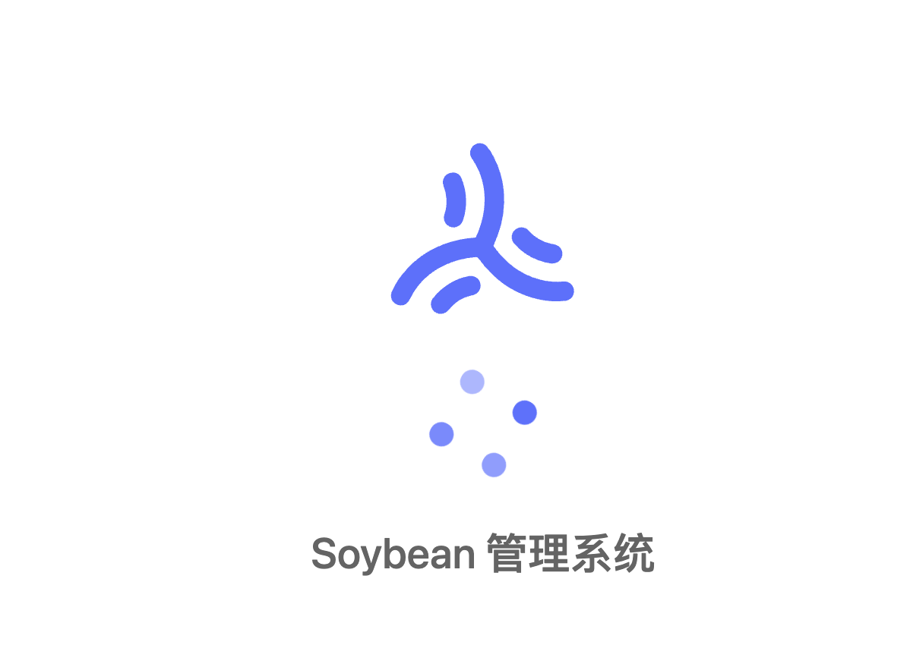

# 系统加载



## 样式

- 系统初始化时的加载样式通过组件 AppLoading 实现

  ::: tip 组件位置
  ./src/components/common/AppLoading.vue
  :::

- 样式的主题色通过 unocss 的 theme 扩展的 primary 得到，对应的值为 css 变量`--primary-color`，从本地缓存获取(在 theme store 中涉及到用本地缓存配置主题颜色)，如果值为空，则默认设置一个颜色值。
  具体实现细节参考

  [系统主题方案](theme.md)

- 系统的 Logo 使用 SystemLogo 组件实现

  [系统图标方案](icon.md)

## 渲染原理

通过 createApp 创建两个实例，分别为系统的 App 实例和用于展示加载的 AppLoading 实例，然后将 AppLoading 先挂载到 id 为 app 的节点里面的 id 为 appLoading 的节点上，优先渲染，然后再将 App 挂载到 id 为 app 的节点上。

```ts
const appLoading = createApp(AppLoading);

appLoading.mount("#appLoading");

const app = createApp(App);

app.mount("#app");
```

::: tip 代码位置
./src/main.ts
:::

```html
<body>
	<div id="app">
		<div id="appLoading"></div>
	</div>
	<script type="module" src="/src/main.ts"></script>
</body>
```

::: tip 代码位置
./index.html
:::
