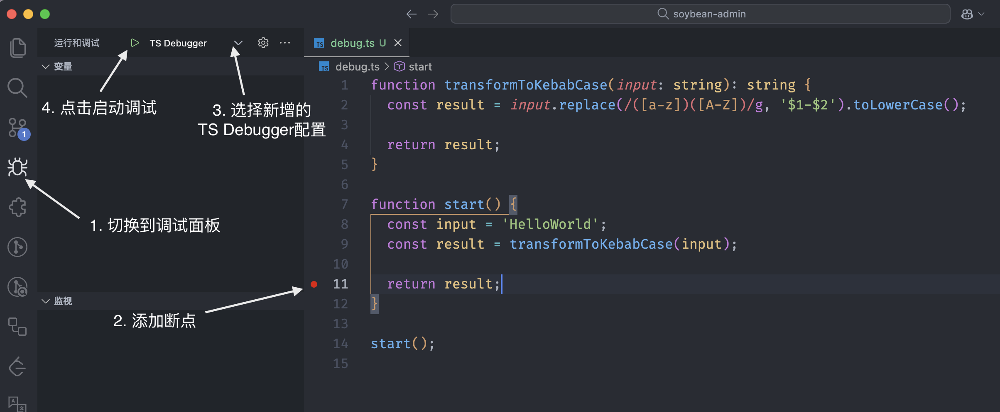
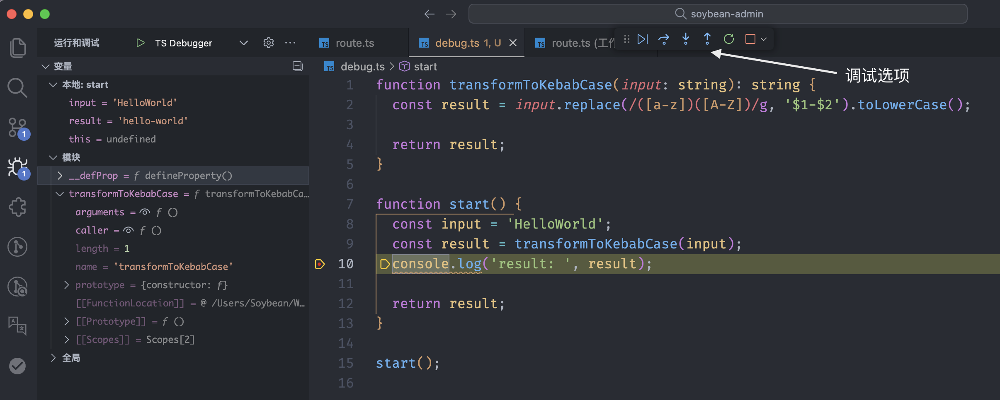

# Debugging

## Overview

In the world of software development, debugging is like a developer's magnifying glass and scalpel. It not only helps us:

- 🔍 Quickly locate and fix code errors
- 🔄 Deeply understand the code execution process
- 📊 Monitor variable states in real-time
- 💾 Analyze memory usage
- ⚡ Optimize program performance

This article will explore how to use VSCode's powerful debugging features to make the debugging process easy and efficient.

## JavaScript and TypeScript Debugging

### tsx - The TypeScript Execution Tool

[`tsx`](https://tsx.is/) is an enhancement for running TypeScript in Node.js, making the execution of TypeScript code simple and straightforward:

- Zero-configuration execution of TypeScript files
- Supports ES modules and CommonJS
- Built-in source map support
- Excellent performance

```bash

Install tsx
npm install -g tsx

Execute TypeScript file
tsx your-file.ts
```

With VSCode's debugging configuration, we can easily achieve advanced features such as breakpoint debugging and variable monitoring. In the next section, we will detail how to configure the debugging environment in VSCode.

> 💡 Tip: VSCode's debugging feature is perfectly integrated with Node.js's debugger, allowing you to easily debug TypeScript code just like debugging JavaScript.

### tsx Debugging Steps

1. First, install the global dependency `tsx`

```bash
npm i -g tsx
```

2. Add the following debugging configuration to the project's `.vscode/launch.json`

```json
{
  "version": "0.2.0",
  "configurations": [
    {
      "type": "node",
      "request": "launch",
      "name": "TS Debugger",
      "runtimeExecutable": "tsx",
      "skipFiles": ["<node_internals>/**", "${workspaceFolder}/node_modules/**"],
      "program": "${file}"
    }
  ]
}
```

3. Debug test

   - Add a new file `debug.ts`
   - Add the following code to `debug.ts`

   ```ts
   function transformToKebabCase(input: string): string {
     return input.replace(/([a-z])([A-Z])/g, '$1-$2').toLowerCase();
   }

   function start() {
     const input = 'HelloWorld';
     const result = transformToKebabCase(input);
     return result;
   }

   start();
   ```

4. Follow the steps in the image to debug




## Vue Debugging

### Debugging Steps

1. Add the following debugging configuration to the project's `.vscode/launch.json`

```json
{
  "version": "0.2.0",
  "configurations": [
    {
      "type": "chrome",
      "request": "launch",
      "name": "Vue Debugger",
      "url": "http://localhost:9527",
      "webRoot": "${workspaceFolder}"
    }
  ]
}
```

> Keep the port number in the url consistent with the port number of the local development environment

2. Start the project locally
3. Test debugging

- Open the page file `about/index.vue`, add a breakpoint in `onMounted`
- Select `Vue Debugger`, click to start debugging - The browser enters the about page, and then automatically jumps back to VSCode
  
  > Similarly, for example, when testing the logic executed after clicking a button, add the corresponding breakpoint in the click event, and then click on the page to trigger the debugging

### Breakpoint Types

- Set breakpoints in component methods
- Set breakpoints in lifecycle hooks
- Set breakpoints in computed properties
- Set breakpoints in watchers
- Set breakpoints in route guards

> Remember to enable source maps in the development environment for the best debugging experience:

```ts
// vite.config.ts
export default defineConfig({
  build: {
    sourcemap: true
  }
```
